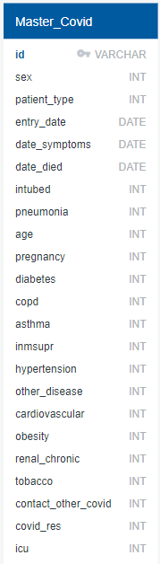

# COVID-19 Patient Data Analysis

----------

Repository to build a machine learning model on Covid19 dataset for insights and prediction.

# Project Description 
This project aims to use a machine learning classification model to predict COVID-19 morbidity based on a patient's demographics and underlying health conditions.

- This dataset is on the individual patent level and includes a patient's  underlying health conditions, basic demographics, COVID-19 result status, ICU and intubation status, and date of death (if applicable).
- We have analyzed this dataset through machine learning to predict several patient outcomes (ICU entry, intubation, and death) based on their demographics and underlying health conditions.
- Our target variable for morbidity prediction is the `date_died` column,  which provides a date value for patient death or a 9999-99-99 for patient survival, and is used to create a new `survival` column of binary values to use in our classification model.
- In addition to predicting patient outcome, we also look at feature importance within the Machine Learning model as a way to see which underlying conditions are most likely to contribute to patient morbidity.

[Click Here](https://docs.google.com/presentation/d/13k2VGWm_J2tI8rKIRiugHNP4i3qLytitx4pIWJaisyA/edit?usp=sharing) for the Google Slides presentation on this topic.

# Project Team Members
The following are the members contributing to this project:

	- Alena Swann
	- Anshu Malini
	- Michael Williams
	- Sajini Thiagaraj
	- Sheetal Tondwalkar
	- Shreya Srivastava

# Team Communication
	- Zoom call every alternate day to discuss the progress 
	- Group slack channel for all discussions

# Tools

    * Creating database
        * PostgreSQL
        * Amazon Web Services(AWS)
        
    * Connecting to database
        * Psycopg2
        
    * Analyzing Data
        * Jupyter Notebook
        * Pandas
        
    * Dashboard and Presentation
	    * Tableau Public
    	* Google Slides
    

## Reason for topic/dataset selection
The Coronavirus (COVID-19), caused by the SARS-CoV-2 virus, is an infectious disease caused by a novel virus that has posed varying health risks and caused significant mortality acorss the world. The initial days of the pandemic had many unknowns and it was observed by medical professionals that the covid-19 symptoms were more severe and mortality was high in patients having certain pre-existing health conditions. This understanding was initially based on the general trend of the deaths happening at that point in time but now with significant data available for many covid-19 patients, machine learning models could be applied to scientifically find a correlation between the mortality due to covid-19 and pre-existing health conditions. Hence, the mexican covid-19 patient dataset was selected to study this correlation and to also use machine learning to determine if having any underlying health condition aggravates the symptoms associated with covid-19.

## Machine Learning Model

- SVM machine learning is best used when the output data needs to be classifed two categories. For this dataset, did the covid patient die or not die would be our classification.
- To make the best prediction for our dataset, we will try many different classification algorithms for our problem.

#### List of tasks to be performed to achieve our goal:
- Read the data file
- Define the Features and Target Variable
- Split the Data into Training and Testing sets
- Train our Model for different Classification Algorithms namely Decision Tree, SVM Classifier, Random Forest Classifier.
- Select the best Algorithm.

## Database
Our provisional database is a CSV file of patient-related information on patients infected with COVID-19, released daily by the Mexican government's [Open Data General Directorate of Epidemiology](https://www.gob.mx/salud/documentos/datos-abiertos-152127 "Open Data General Directorate of Epidemiology"). 

For Machine Learning exploration, we will be using a subset of the data (1/1/2020-5/31/2020) that has been cleaned and obtained from [Kaggle](https://www.kaggle.com/tanmoyx/covid19-patient-precondition-dataset). Once a final model has been decided upon and tested, we will implement the full-scale dataset. 

The dataset will be loaded into a PostgreSQL database managed through pgAdmin 4, and then connected to Jupyter Notebook for machine learning model manipulation. The initial master data table schema is as follows:

#### Column Descriptions
	-	ID	Case identifier number.
	-	SEX	Identifies the sex of the patient.
	-	PATIENT_TYPE Identifies the type of care received by the patient in the unit. It is called an outpatient if you returned home or it is called an inpatient if you were admitted to hospital.
	-	ENTRY_DATE	Identifies the date of the patient's admission to the care unit.
	-	DATE_SYMPTOMS	Identifies the date on which the patient's symptoms began.
	-	DATE_DIED	Identifies the date the patient died.
	-	INTUBED	Identifies if the patient required intubation.
	-	PNEUMONIA	Identifies if the patient was diagnosed with pneumonia.
	-	AGE	Identifies the age of the patient.
	-	PREGNANCY	Identifies if the patient is pregnant.
	-	DIABETES	Identifies if the patient has a diagnosis of diabetes.
	-	COPD	Identifies if the patient has a diagnosis of COPD.
	-	ASTHMA	Identifies if the patient has a diagnosis of asthma.
	-	INMSUPR	Identifies if the patient has immunosuppression.
	-	HYPERTENSION	Identifies if the patient has a diagnosis of hypertension.
	-	OTHER_DISEASE	Identifies if the patient has a diagnosis of other diseases.
	-	CARDIOVASCULAR	Identifies if the patient has a diagnosis of cardiovascular disease.
	-	OBESITY	Identifies if the patient is diagnosed with obesity.
	-	RENAL_CHRONIC	Identifies if the patient has a diagnosis of chronic kidney failure.
	-	TOBACCO	Identifies if the patient has a smoking habit.
	-	CONTACT_OTHER_COVID	Identifies if the patient had contact with any other case diagnosed with SARS CoV-2
	-	COVID_RES	Identifies the result of the analysis of the sample reported by the laboratory of the National Network of Epidemiological Surveillance Laboratories.
	-	ICU	Identifies if the patient required to enter an Intensive Care Unit.

    
